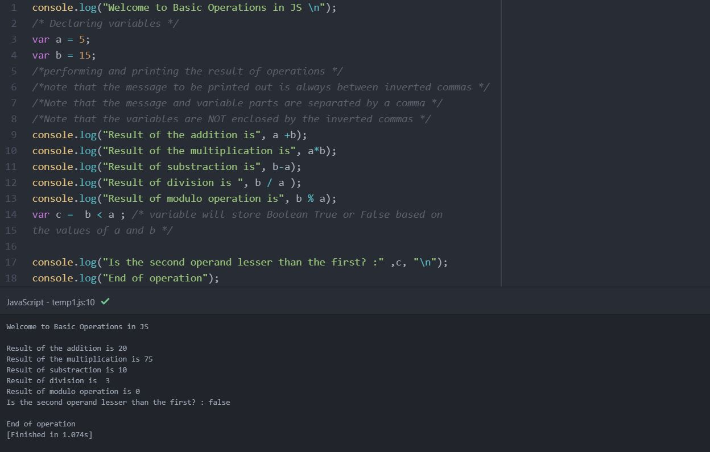

CONTENTS :
<ul>
  
<li>Overview</li>
<li>Hello, World!</li>
<li>Declaring Variables</li>
<li>Performing Basic Operations</li>
<li>Reference</li>
</ul>

<h4>OVERVIEW</h4>
In the 2020 StackOverflow survey, JavaScript came out as the most used language. This is the eighth consecutive year it has done so! It is not at all surprising given that since it’s inception, JS has come a long way and is now powering most websites – be it at the frontend or the backend. Learning JS can be a huge booster to your skill set and can help you start your career as a web developer.

JavaScript was designed by Brendan Eich in 1994-95. It uses a curly-bracket ‘{ }’ syntax , much like C/C++ and is dynamically typed like Python. Although used for interactive web designing, JavaScript is an all purpose programming language that can be used for server side programming using Node.JS famework and also for creating browser based games.

This post aims to familiarize you with the basic syntax of JavaScript and get you started on your journey to being a web developer. If you are a beginner and just want to get a brief idea about JS fundamentals then this is the right post for you.

<h4>HELLO, WORLD!</h4>

Going by the tenets of our coder religion, we will start off with the ritualistic “Hello, World!” program. In JavaScript, we use ‘console.log( )’ to print out a message. Although optional, by convention we add the semi-colon ( ; ) at the end of our JS statements . In case we miss that semicolon, JavaScript adds it behind the curtain. I’ll be using Atom text editor for my codes but feel free to use whichever editor you prefer.

console.log("Hello, World!");

<h4>DECLARING VARIABLES </h4>
A variable can best be thought of as a box. You store your belongings in your box and call it something, say, ‘My box’ . Similarly, in programming, a variable is used to store data that we can work with later on. The variable that you use to keep your values in is the name of your variable, say, ‘variableName’.

Declaring Variables in JavaScript is done using the keyword ‘var’ . Since JS is a dynamically typed language, you do not need to mention the data types while declaring a new variable. Let us look at the syntax for variable declaration :

var variableName;

var variableName = value ;

var i;
var i =10;
var i = "dowhileblog" ; // all three are legal ways to declare 

The ES6 update of JS brought two new ways of declaring variables : ‘let’ and ‘const’. However, I believe that we must understand scopes and functions before touching this small topic.

<h4>PERFORMING BASIC OPERATIONS</h4>
Now, building on the two sections that we have just covered, let us do some really simple operations to get comfortable with the language. We will be performing simple mathematical operations and printing out the results. Make sure that you always comment out your code so that it becomes more readable. In Javascript, you can add a comment in your source code by placing your comment between a set of ‘ /* ‘ and ‘ */ ‘.

In the below example, we have first declared and assigned values to our variables a and b. After that, we have performed some basic mathematical operations on the variables. Notice that the operations are directly performed into the console.log( ) statement and not being stored in any specific variable. You may also notice that we have used ‘ \n’ which is a newline operator, meaning that it sends the output after it onto a new line below it.
 

 
In JavaScript, we use a comma ( , ) to separate a message from the variables in the console.log( ) statement. The message part is always enclosed by inverted commas. While you can use single inverted comma for the message part, we tend to use the double inverted comma as a convention.

I hope that as promised, this was a light but informational post for beginners who are thinking of learning JavaScript. In the next post, we will be taking a closer look at the JavaScript conditional statements and loops.

